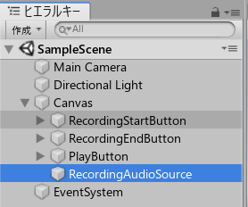
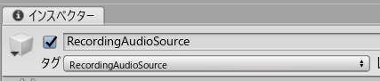

# Unity 録音、再生サンプルプログラム

<!-- @import "[TOC]" {cmd="toc" depthFrom=1 depthTo=6 orderedList=false} -->
<!-- code_chunk_output -->

- [Unity 録音、再生サンプルプログラム](#unity-録音-再生サンプルプログラム)
  - [1. 概要](#1-概要)
  - [2. 機能](#2-機能)
    - [2.1. 各ボタン共通の初期処理(Start)](#21-各ボタン共通の初期処理start)
      - [2.1.1. 使用メソッド](#211-使用メソッド)
        - [2.1.1.1. UnityEngine.Microphone.devices](#2111-unityenginemicrophonedevices)
        - [2.1.1.2. GameObject.FindGameObjectWithTag](#2112-gameobjectfindgameobjectwithtag)
    - [2.2. 録音開始(RecordingStartButton)](#22-録音開始recordingstartbutton)
      - [2.2.1. 使用メソッド](#221-使用メソッド)
        - [2.2.1.1. UnityEngine.Microphone.Start](#2211-unityenginemicrophonestart)
    - [2.3. 録音停止(RecordingEndButton)](#23-録音停止recordingendbutton)
      - [2.3.1. 使用メソッド](#231-使用メソッド)
        - [2.3.1.1. UnityEngine.Microphone.IsRecording](#2311-unityenginemicrophoneisrecording)
        - [2.3.1.2. UnityEngine.Microphone.GetPosition](#2312-unityenginemicrophonegetposition)
        - [2.3.1.3. UnityEngine.Microphone.End](#2313-unityenginemicrophoneend)
    - [2.4. 再生(PlayButton)](#24-再生playbutton)
      - [2.4.1. 使用メソッド](#241-使用メソッド)
        - [2.4.1.1. UnityEngine.AudioSource.Play](#2411-unityengineaudiosourceplay)
    - [2.5. その他](#25-その他)
      - [2.5.1. 各ボタン共通で使用するAudioSourceについて](#251-各ボタン共通で使用するaudiosourceについて)

<!-- /code_chunk_output -->

## 1. 概要
Unityに配置した下記ボタンから録音、再生を行うサンプルプログラム。
- 録音開始ボタン
- 録音停止ボタン
- 再生ボタン

## 2. 機能
### 2.1. 各ボタン共通の初期処理(Start)
ゲーム再生時の初期処理(各スクリプトのStartメソッド)。
端末に接続されているマイクデバイスを検出し、マイクデバイス名を保持する。
また、録音用に予めタグ設定したAudioSource( `RecordingAudioSource` )を取得し、各ボタン処理で使いまわせる様初期化する。

#### 2.1.1. 使用メソッド
##### 2.1.1.1. UnityEngine.Microphone.devices
使用するマイクデバイスの名称を取得するために使用。
端末内で使用可能なマイクデバイスを取得する。

##### 2.1.1.2. GameObject.FindGameObjectWithTag
録音用のAudioSourceを各ボタン処理で使いまわすために使用。

▪ 引数
|No.|物理名|論理名|型|設定値|備考|
|:--|:--|:--|:--|:--|:--|
|1|tag|タグ名|string|AudioSourceに設定したタグ名|サンプルでは `RecordingAudioSource` を使用|

---

### 2.2. 録音開始(RecordingStartButton)
端末のマイクデバイスを検索し、デフォルト設定になっているマイクデバイスを使用して録音を開始する。
最大録音時間を経過した場合、Updateメソッド内で自動終了を検出し音源保存を行う。
サンプリングレート: 44,100Hz

#### 2.2.1. 使用メソッド
##### 2.2.1.1. UnityEngine.Microphone.Start
指定マイクデバイスを使用して録音を開始する。

▪ 引数
|No.|物理名|論理名|型|設定値|備考|
|:--|:--|:--|:--|:--|:--|
|1|deviceName|デバイス名|string|各ボタン共通の初期処理にて取得したマイクデバイス名|－|
|2|loop|ループ録音|bool|false|ループ録音を行なうかどうかのフラグ。 行なう場合は lengthSec に到達したときにクリップの最初に戻って録音を継続する。|
|3|lengthSec|録音秒数|int|任意設定|サンプルは `3599`|
|4|frequency|サンプリングレート|int|任意設定|サンプルは `44100`|

---

### 2.3. 録音停止(RecordingEndButton)
録音したマイクデバイスを停止し、AudioClip、及びWavファイルへ録音内容を保存する。
当ボタンの押下タイミングが、[2.2. 録音開始](#22-録音開始recordingstartbutton)で指定した最大録音時間未満の場合、停止後から末尾までの無音部分を除外する。
※Unityの仕様で無音部分が含まれる。
ファイル保存先:
`C:/Users/#{ユーザー}/AppData/LocalLow/DefaultCompany/UnitySoundRecording\audiofile_#{録音終了日時}.wav`

#### 2.3.1. 使用メソッド
##### 2.3.1.1. UnityEngine.Microphone.IsRecording
マイクデバイスが録音中かどうかのチェック時に使用。

##### 2.3.1.2. UnityEngine.Microphone.GetPosition
録音中の音源の現在位置(Byte)をを取得する。
サンプルでは無音部分を除外するために使用している。

▪ 引数
|No.|物理名|論理名|型|設定値|備考|
|:--|:--|:--|:--|:--|:--|
|1|deviceName|デバイス名|string|各ボタン共通の初期処理にて取得したマイクデバイス名|－|

##### 2.3.1.3. UnityEngine.Microphone.End
録音を停止する。

▪ 引数
|No.|物理名|論理名|型|設定値|備考|
|:--|:--|:--|:--|:--|:--|
|1|deviceName|デバイス名|string|各ボタン共通の初期処理にて取得したマイクデバイス名|－|

---

### 2.4. 再生(PlayButton)
録音したAudioClipを再生する。

#### 2.4.1. 使用メソッド
##### 2.4.1.1. UnityEngine.AudioSource.Play
AudioSource.clipに格納されているAudioClipをデフォルト設定のスピーカーから再生する。

---

### 2.5. その他
#### 2.5.1. 各ボタン共通で使用するAudioSourceについて
各ボタン共通で使用するAudioSourceについては、
Unityのシーン内で各ボタンを配置しているCanvas内に予め配置しておく必要がある。
配置後さらに、スクリプトから各ボタンから使いまわせるようにタグ設定が必要。

1．CanvasにAudioSourceを追加(RecordingAudioSource)

2. インスペクタータブでタグ設定
[タグクリック] → [タグを追加] → [タグ配下の＋ボタンクリック]
→ [任意の名前でsave] → [ヒエラルキータブのAudioSourceクリック]
→ [再度インスペクタータブで追加したタグを選択] → [保存]

